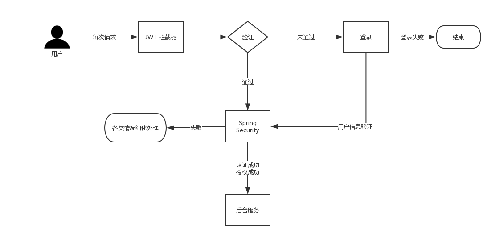

# 欢迎
>本项目是一套完整的后台框架，基于SpringBoot+Mybatis实现，专注于后台代码的完善

> 如果该项目对您有帮助，您可以点右上角 "Star" 支持一下 谢谢！

> 或者您可以 "follow" 一下

> 如有问题或者好的建议可以在 Issues 中提。

> 相应的文章在我的博客可以看到：https://blog.csdn.net/zzxzzxhao/article/details/83381876

> 下个项目准备弄一个微服务，以SpringCloud来搭建，zuul+eureka+Hystrix+SpringCloud Config+RabbitMq+Feign，
> 项目已搭好，现在在集成Spring Security Oauth2做认证鉴权，有兴趣的小伙伴多留意哦！

#### 开发环境

工具| 版本号
----|----
JDK | 1.8
Mysql | 8.0.11
Redis | 3.2.100

#### 技术选型

技术| 说明
----|----
Spring Boot | 容器+MVC框架
Spring Security | 认证和授权框架
MyBatis | ORM框架
PageHelper | MyBatis物理分页插件
Redis | 分布式缓存
Druid | 数据库连接池
JWT | JWT登录支持
Lombok | 简化对象封装工具
Logback | 日志收集

##### 系统架构图

##### 项目介绍
本项目大体思想就是，token作为前后端交互的身份验证信息，通过设置token的刷新时间保证token的安全性，同时将token放入redis，并建立黑名单，多重保障下确保安全性；
Spring Security实现对用户的认证授权（本项目尚未实现权限细化处理）

`AjaxAccessDeniedHandler`处理无权访问的情况，直接向前端响应返回相应的json字符串。`AjaxAuthenticationEntryPoint`处理未登录的情况、`AjaxAuthenticationFailureHandler`处理登录失败的情况；

`AjaxAuthenticationSuccessHandler`处理登录成功的情况，同时生成token，并且把用户登录信息，如ip地址、用户名、登录时间、有效时间保存至redis中。

`AjaxLogoutSuccessHandler`处理登出成功的情况，在登出的同时，把当前用户的token放入redis黑名单中。

`JwtAuthenticationTokenFilter`基础Spring的`OncePerRequestFilter`实现每一次请求的过滤。在每次过滤的时候，我们从请求头取出token，验证ip是否与当前ip一致。如果不一致，那么进行黑名单验证，如果token在黑名单中，则本次请求不通过。接着验证token是否过期，如果token过期了，则去redis中取出过期时间，如果仍在有效时间内，则刷新token，并放入到请求头中。
